# 스포츠센터 회원 관리 프로그램 - 클래스 다이어그램 (Class Diagram)

기능 명세서의 수강 취소 요구사항과 더불어 결합도를 낮추기 위한 **Java Interface 구조**를 새롭게 적용한 MVC 아키텍처 다이어그램입니다.

## MVC 아키텍처 클래스 다이어그램 (Interface 분리 적용)

```mermaid
classDiagram
    %% Utility
    class DBConnectionUtil {
        <<util>>
        +getConnection() Connection
    }

    %% Model (DTOs)
    class MemberDTO {
        -int id
        -String name
        -String phone
        -String gender
        -Date birthDate
        -Timestamp createdAt
        -String notes
        +getter()
        +setter()
    }
    class LessonDTO {
        -int id
        -String name
        -String dayOfWeek
        -String time
        -String instructorName
        -int capacity
        -int price
        +getter()
        +setter()
    }
    class EnrollmentDTO {
        -int id
        -int memberId
        -int lessonId
        -Date startDate
        -Date endDate
        -Date paymentDate
        -String lessonName
        +getter()
        +setter()
    }

    %% Model (DAO Interfaces)
    class IMemberDAO {
        <<interface>>
        +insertMember(MemberDTO) boolean
        +getAllMembers() List~MemberDTO~
        +searchMembers(String) List~MemberDTO~
        +updateMember(MemberDTO) boolean
        +deleteMember(int) boolean
    }
    class ILessonDAO {
        <<interface>>
        +insertLesson(LessonDTO) boolean
        +getAllLessons() List~LessonDTO~
        +updateLesson(LessonDTO) boolean
        +deleteLesson(int) boolean
    }
    class IEnrollmentDAO {
        <<interface>>
        +insertEnrollment(EnrollmentDTO) boolean
        +getEnrollmentsByMemberId(int) List~EnrollmentDTO~
        +deleteEnrollment(int) boolean
    }

    %% Model (DAO Implementations)
    class MemberDAOImpl {
        <<implementation>>
    }
    class LessonDAOImpl {
        <<implementation>>
    }
    class EnrollmentDAOImpl {
        <<implementation>>
    }

    %% Interface Implementations
    IMemberDAO <|.. MemberDAOImpl : implements
    ILessonDAO <|.. LessonDAOImpl : implements
    IEnrollmentDAO <|.. EnrollmentDAOImpl : implements

    %% View (UI Components)
    class MainFrame {
        -JTable memberTable
        -JTextField searchField
        +displayMembers(List~MemberDTO~)
        +refreshTable()
    }
    class MemberDetailDialog {
        -JTable enrollmentTable
        +displayMemberInfo(MemberDTO)
        +displayEnrollments(List~EnrollmentDTO~)
        +addCancelEnrollmentListener(ActionListener)
    }
    class MemberFormDialog {
        +getFormData() MemberDTO
        +setFormData(MemberDTO)
    }
    class LessonManageDialog {
        -JTable lessonTable
        +displayLessons(List~LessonDTO~)
    }
    class EnrollmentFormDialog {
        +getFormData() EnrollmentDTO
    }

    %% Controller
    class MainController {
        -MainFrame view
        -IMemberDAO memberDAO
        +loadMembers()
        +searchMembers(String)
        +openMemberDetail(int)
    }
    class MemberController {
        -IMemberDAO memberDAO
        +saveMember(MemberDTO)
        +updateMember(MemberDTO)
        +deleteMember(int)
    }
    class LessonController {
        -LessonManageDialog view
        -ILessonDAO lessonDAO
        +loadLessons()
        +saveLesson(LessonDTO)
        +deleteLesson(int)
    }
    class EnrollmentController {
        -MemberDetailDialog view
        -IEnrollmentDAO enrollmentDAO
        +loadEnrollments(int)
        +saveEnrollment(EnrollmentDTO)
        +cancelEnrollment(int)
    }

    %% 의존 관계 (Relationships)
    MemberDAOImpl --> DBConnectionUtil : uses
    LessonDAOImpl --> DBConnectionUtil : uses
    EnrollmentDAOImpl --> DBConnectionUtil : uses

    MainController --> MainFrame : controls
    MainController --> IMemberDAO : references (DI)

    MemberController --> MemberFormDialog : controls
    MemberController --> IMemberDAO : references (DI)

    LessonController --> LessonManageDialog : controls
    LessonController --> ILessonDAO : references (DI)

    EnrollmentController --> MemberDetailDialog : controls
    EnrollmentController --> EnrollmentFormDialog : controls
    EnrollmentController --> IEnrollmentDAO : references (DI)
```

### 아키텍처 주요 변경 사항

- **Java Interface 도입:** `IMemberDAO`, `ILessonDAO`, `IEnrollmentDAO` 인터페이스를 새롭게 정의하여 다형성(Polymorphism)을 활용합니다. Controller 계층은 구체적인 구현체(Impl)가 아닌 추상화된 인터페이스(`IMemberDAO` 등)를 의존(DI)하게 되므로, 향후 DB 변경이나 테스트(Mock 객체 사용)가 매우 쉬워지는 **느슨한 결합(Loose Coupling)** 구조를 달성했습니다.
- **수강 취소 기능 반영:** `EnrollmentController`에 `cancelEnrollment(int id)` 로직이, `IEnrollmentDAO`에 `deleteEnrollment(int id)`가, `MemberDetailDialog`에 `[수강 취소]` 버튼을 위한 이벤트 리스너 메서드가 추가되었습니다.
