# 스포츠센터 회원 관리 프로그램 - 클래스 다이어그램 (Class Diagram)

현재 코드베이스에 완벽하게 일치하도록 상세화된 MVC 아키텍처 다이어그램입니다. 각 계층간의 의존성, 인터페이스 분리, 그리고 구체적인 필드 및 메서드 관계를 명확히 나타냅니다.

## MVC 아키텍처 다이어그램

```mermaid
classDiagram
    %% Utility
    class DBConnectionUtil {
        <<util>>
        -Dotenv dotenv$
        -String URL$
        -String USER$
        -String PASSWORD$
        +getConnection()$ Connection
    }

    %% Model (DTOs)
    class MemberDTO {
        -int id
        -String name
        -String phone
        -String gender
        -Date birthDate
        -Timestamp createdAt
        -String notes
        +getter()
        +setter()
    }
    class LessonDTO {
        -int id
        -String name
        -String dayOfWeek
        -String time
        -String instructorName
        -int capacity
        -int price
        +getter()
        +setter()
    }
    class EnrollmentDTO {
        -int id
        -int memberId
        -int lessonId
        -Date startDate
        -Date endDate
        -Date paymentDate
        -String lessonName
        +getter()
        +setter()
    }

    %% Model (DAO Interfaces)
    class IMemberDAO {
        <<interface>>
        +insertMember(MemberDTO) boolean
        +getAllMembers() List~MemberDTO~
        +searchMembers(String) List~MemberDTO~
        +updateMember(MemberDTO) boolean
        +deleteMember(int) boolean
    }
    class ILessonDAO {
        <<interface>>
        +insertLesson(LessonDTO) boolean
        +getAllLessons() List~LessonDTO~
        +updateLesson(LessonDTO) boolean
        +deleteLesson(int) boolean
    }
    class IEnrollmentDAO {
        <<interface>>
        +insertEnrollment(EnrollmentDTO) boolean
        +getEnrollmentsByMemberId(int) List~EnrollmentDTO~
        +deleteEnrollment(int) boolean
        +getEnrollmentCountByLessonId(int) int
        +isAlreadyEnrolled(int, int) boolean
    }

    %% Model (DAO Implementations)
    class MemberDAOImpl {
        <<implementation>>
    }
    class LessonDAOImpl {
        <<implementation>>
    }
    class EnrollmentDAOImpl {
        <<implementation>>
    }

    IMemberDAO <|.. MemberDAOImpl
    ILessonDAO <|.. LessonDAOImpl
    IEnrollmentDAO <|.. EnrollmentDAOImpl

    %% View (UI Components)
    class MainFrame {
        -JTable memberTable
        -JTable lessonTable
        -JTextField searchField
        +displayMembers(List~MemberDTO~)
        +displayLessons(List~LessonDTO~)
        +addSearchListener()
        +addAddMemberListener()
    }
    class MemberDetailDialog {
        -JTable enrollmentTable
        +displayMemberInfo(MemberDTO)
        +displayEnrollments(List~EnrollmentDTO~)
    }
    class MemberFormDialog {
        +getFormData() MemberDTO
        +setFormData(MemberDTO)
    }
    class LessonManageDialog {
        +getFormData() LessonDTO
        +setFormData(LessonDTO)
    }
    class EnrollmentFormDialog {
        +getFormData() EnrollmentDTO
    }

    %% Controller
    class Main {
        +main(String[])$
    }
    class MainController {
        -MainFrame view
        -IMemberDAO memberDAO
        -ILessonDAO lessonDAO
        +loadMembers()
        +loadLessons()
        +searchMembers(String)
        -openMemberDetail()
        -openLessonEdit()
    }
    class MemberController {
        -MemberFormDialog view
        -IMemberDAO memberDAO
        -MainController mainController
        -saveMember()
        -deleteMember()
    }
    class LessonController {
        -LessonManageDialog view
        -ILessonDAO lessonDAO
        -MainController mainController
        -saveLesson()
        -deleteLesson()
    }
    class EnrollmentController {
        -MemberDetailDialog view
        -IEnrollmentDAO enrollmentDAO
        -ILessonDAO lessonDAO
        -IMemberDAO memberDAO
        -MainController mainController
        +loadEnrollments(int)
        -openEnrollmentForm()
        -cancelEnrollment()
    }

    %% Relationships
    Main --> MainFrame : creates
    Main --> MainController : creates
    Main --> MemberDAOImpl : creates
    Main --> LessonDAOImpl : creates

    MemberDAOImpl ..> DBConnectionUtil : uses
    LessonDAOImpl ..> DBConnectionUtil : uses
    EnrollmentDAOImpl ..> DBConnectionUtil : uses

    MainController o-- MainFrame
    MainController o-- IMemberDAO
    MainController o-- ILessonDAO

    MemberController o-- MemberFormDialog
    MemberController o-- IMemberDAO
    MemberController --> MainController : triggers loadMembers()

    LessonController o-- LessonManageDialog
    LessonController o-- ILessonDAO
    LessonController --> MainController : triggers loadLessons()

    EnrollmentController o-- MemberDetailDialog
    EnrollmentController o-- IEnrollmentDAO
    EnrollmentController o-- ILessonDAO
    EnrollmentController o-- IMemberDAO
    EnrollmentController --> MainController : triggers loadMembers()
```

### 아키텍처 및 의존성 특징
1. **의존성 주입 (Dependency Injection)**: 각 컨트롤러는 생성자를 통해 View와 연관된 DAO 모델을 주입받아 사용합니다.
2. **다형성 보장**: `IMemberDAO`, `ILessonDAO`, `IEnrollmentDAO` 등 인터페이스를 통한 접근으로 추후 DB 교체 등에 유연하게 대처할 수 있습니다.
3. **Controller 간의 통신**: `MemberController`, `LessonController`, `EnrollmentController` 작업 완료 후 테이블 목록 최신화를 위해 상위인 `MainController`의 메서드를 호출(콜백과 유사한 방식)하여 View를 갱신합니다.
4. **비동기 뷰 리렌더링**: 각 Controller에서는 모델로부터 데이터를 가져올 때 `SwingWorker`를 사용하여 UI 블로킹을 방지합니다.
