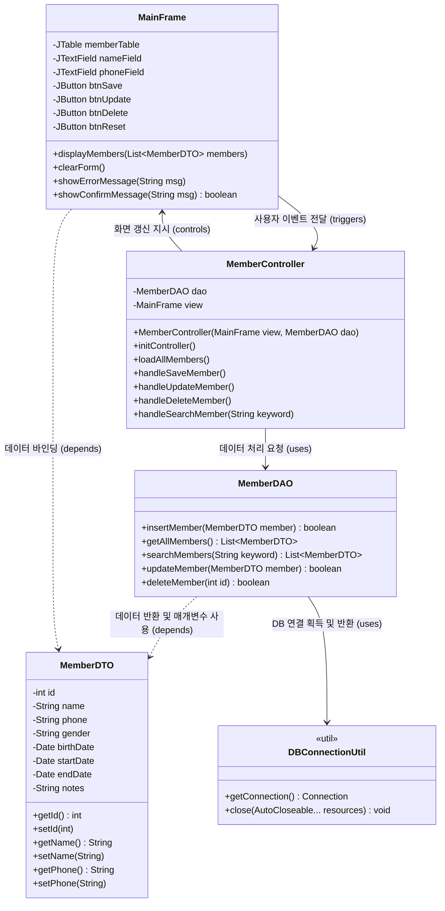

# 스포츠센터 회원 관리 프로그램 - 클래스 다이어그램 (Class Diagram)

본 다이어그램은 MVC(Model-View-Controller) 아키텍처 패턴을 기반으로 한 전체 시스템의 주요 클래스 구조와 의존 관계를 나타냅니다.

## MVC 아키텍처 클래스 다이어그램

### 각 패키지 및 클래스 설명
* **`com.sportscenter.model` (Model 계층)**
  * `MemberDTO`: 회원 1명의 정보를 담는 데이터 전송 객체입니다. (로직 없음)
  * `MemberDAO`: MariaDB와 통신하여 실제 쿼리(`INSERT`, `SELECT`, `UPDATE`, `DELETE`)를 실행하는 데이터 접근 객체입니다.
* **`com.sportscenter.view` (View 계층)**
  * `MainFrame`: Java Swing 기반의 데스크톱 화면 UI입니다. 사용자 입력을 받고, 컨트롤러에 이벤트를 전달합니다.
* **`com.sportscenter.controller` (Controller 계층)**
  * `MemberController`: View에서 발생한 이벤트를 감지하여 DAO를 호출하고, 그 결과(DTO)를 다시 View로 넘겨주는 중재자 역할을 합니다. (`SwingWorker`를 통한 비동기 처리가 이곳에서 이루어질 수 있습니다.)
* **`com.sportscenter.util` (Utility 계층)**
  * `DBConnectionUtil`: DB 연결(Connection)을 가져오고 리소스를 안전하게 닫아주는 유틸리티 클래스입니다.
