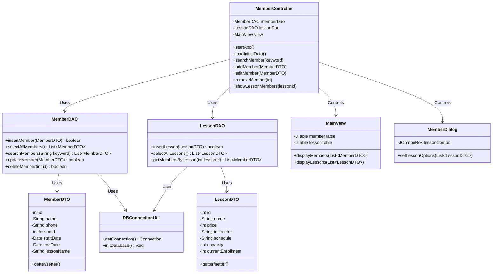

# 스포츠센터 회원 관리 프로그램 개발 계획서

## 1. 프로젝트 개요 및 기술 스택
본 프로젝트는 스포츠센터의 회원 정보 및 강좌 정보를 효율적으로 관리하기 위한 Java 기반 데스크톱 애플리케이션입니다.

- **언어 및 버전**: Java 25
- **UI 프레임워크**: Java Swing
- **데이터베이스**: MariaDB (Docker 환경)
- **빌드/환경**: Maven
- **아키텍처 패턴**:
  - **MVC 패턴**: 모델(Model), 뷰(View), 컨트롤러(Controller) 분리.
  - **DAO/DTO 패턴**: 데이터 접근 객체와 전송 객체 분리.
  - **리소스 관리**: DB 연결 리소스는 `try-with-resources`로 안전하게 반환.

---

## 2. 세부 기능 요구사항 (Functional Requirements)

1. **프로그램 및 DB 초기화 기능**
   - **요구사항**: 프로그램 실행 시 또는 UI 내 'DB 초기화' 클릭 시, `lessons` 및 `members` 테이블이 생성되고 테스트용 더미 데이터가 삽입됨.
   - **제약사항**: `IF NOT EXISTS` 사용. 외래키(FK) 참조 무결성을 위해 `lessons` 테이블이 먼저 생성되어야 함.

2. **강좌 관리 (Lesson)**
   - **요구사항**: 개설된 강좌 목록(강좌명, 가격, 강사, 시간, 정원 등)을 조회하는 기능. 특정 강좌를 선택하면 해당 강좌를 수강 중인 회원 목록을 확인할 수 있어야 함.

3. **회원 등록 (Create)**
   - **요구사항**: 이름, 연락처, 강좌 선택(DB의 `lessons` 데이터 참조), 등록일, 만료일 입력 후 DB에 새롭게 저장. 회원 테이블의 `lesson_id`에 강좌 id 저장.

4. **회원 목록 조회 및 검색 (Read)**
   - **요구사항**: JTable에 전체 회원을 표시. 강좌 정보도 JOIN을 통해 함께 표시. 이름이나 연락처 일부로 검색 기능 제공.

5. **회원 정보 수정 (Update)**
   - **요구사항**: 회원 선택 후 '수정' 클릭 시 정보가 채워진 폼 노출. 강좌 변경, 날짜 등 수정 후 반영.

6. **회원 삭제 (Delete)**
   - **요구사항**: 삭제 전 경고창 표시 후 확인 시 DB에서 삭제.

---

## 3. 데이터베이스 스키마 설계

- **Database**: `sportscenter_db`

### 3.1 `lessons` (강좌 테이블)
| 필드명 | 데이터 타입 | 제약 조건 | 설명 |
| :--- | :--- | :--- | :--- |
| `id` | INT | PK, AUTO_INCREMENT | 강좌 고유 식별 번호 |
| `name` | VARCHAR(100) | NOT NULL | 강좌명 |
| `price` | INT | NOT NULL | 수강료 (가격) |
| `instructor` | VARCHAR(50) | NOT NULL | 담당 강사 이름 |
| `schedule` | VARCHAR(100)| NOT NULL | 시간/요일 (예: 월수금 19:00) |
| `capacity` | INT | NOT NULL | 정원 (수용 인원) |
| `current_enrollment`| INT| DEFAULT 0 | 현재 수강 인원 (선택 사항) |

### 3.2 `members` (회원 테이블)
| 필드명 | 데이터 타입 | 제약 조건 | 설명 |
| :--- | :--- | :--- | :--- |
| `id` | INT | PK, AUTO_INCREMENT | 회원 고유 식별 번호 |
| `name` | VARCHAR(50) | NOT NULL | 회원 이름 |
| `phone` | VARCHAR(20) | NOT NULL | 연락처 |
| `lesson_id` | INT | FK (lessons.id) | 수강 중인 강좌의 ID |
| `start_date` | DATE | NOT NULL | 등록일 (시작일) |
| `end_date` | DATE | NOT NULL | 만료일 (종료일) |

---

## 4. 클래스 다이어그램 (Class Diagram)

---

## 5. 전체 개발 마일스톤 (Milestones)

- **[M1] Maven 환경 구성 및 프로젝트 기획 (완료)**
  - `pom.xml` 구성 및 요구사항 명세 완료
- **[M2] DB 연동 모듈 (DAO/DTO, Util) 구현**
  - `DBConnectionUtil.java` 구현
  - `LessonDTO.java`, `LessonDAO.java` 구현
  - `MemberDTO.java`, `MemberDAO.java` 구현
  - `init.sql` 스크립트 작성
- **[M3] Swing 사용자 인터페이스(View) 구성**
  - `MainView.java` (회원 목록 및 강좌 목록 뷰)
  - `MemberDialog.java`
- **[M4] 비즈니스 로직 및 이벤트 제어(Controller) 연동**
  - 컨트롤러 이벤트 및 예외 처리
- **[M5] 통합 테스트, 디버깅 및 사용자 매뉴얼 작성**
  - `README.md` 작성
